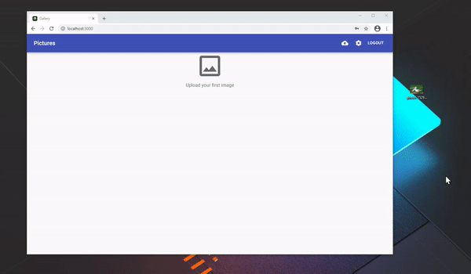
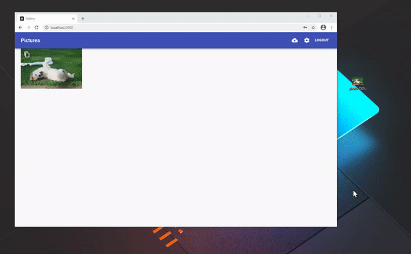
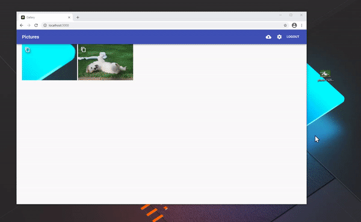

# Personal image gallery
[](https://github.com/karasevm/personal-gallery-node/actions/workflows/test.yml)
[](https://github.com/karasevm/personal-gallery-node/actions/workflows/publish.yml)

A simple to use, modern place to store your images. Perfect for storing large 
amounts of screenshots and screen recordings. 

## Uploading 
After searching for a solution that would allow me to upload easily from every 
kind of device, I've decided to make my own. If you are using a relatively modern
device, you probably can upload images from it.

### Dialog
Click the upload icon and then click the upload area to trigger a system file
pick dialog.

### Drag-n-drop
Simply drag any file into the window, and the upload area should magically appear.


### Paste
Got a screenshot in your clipboard, Ctrl-V and now you've got it online.


### API
Want use your own uploader? You can. Get the API key, put it into the `Authorization`
header and that's it.

### ShareX
While we're on the topic of APIs, if you're using ShareX you can simply get
a ready made custom uploader config.


### Android
Sharing on mobile is easier than ever thanks to the PWA Share Target APIs.


## Installation

### Docker (Reccommended)
The image is available on dockerhub, you can start with an example 
docker-compose below:
```yaml
version: '3'
services:
  gallery:
    image: karasevm/personal-gallery-node
    ports:
      - 80:80
    volumes:
      - ./images:/images
      - ./db:/db
      - ./cache:/cache
    restart: unless-stopped
    environment:
      - CACHE_DIR=/cache
```
**Environment Variables**

All docker environment variables are optional

`PORT` - which port to listen on, by default set to 80

`PROXY` - [express proxy settings](https://expressjs.com/en/guide/behind-proxies.html), by default set to `true`

`USERNAME` and `PASSWORD` - used to reset user credentials, if set, all sessions and API key are invalidated

`BASE_URL` - base directory if app isn't in root

`FULLS_AS_THUMBS` - whether to use full size images as thumbnails (useful on slow servers with fast clients)

To use Redis instead of built-it memory cache:

`REDIS_HOST` - Redis host

`REDIS_PASSWORD` - Redis password

Or to store cache on disk :

`CACHE_DIR` - Cache directory


### On bare machine
You'll need node 14+ and yarn to complete the build. 
Copy the .env.example to .env, changing it according to your needs. In the root directory run `yarn build` then `yarn start`, if everything went well, you'll have the server running.

## Develompent
Clone the repo, set the server environment with .env, install dependencies, start with `yarn start-dev`.

REST API documentation is available [here](packages/server/docs/api/README.md)

## Contributing
Easiest way to contribute is to submit a translation, use `./packages/web/public/locales/en.json` 
as a template and submit a pull request with your language.

## License
[MIT](LICENSE)